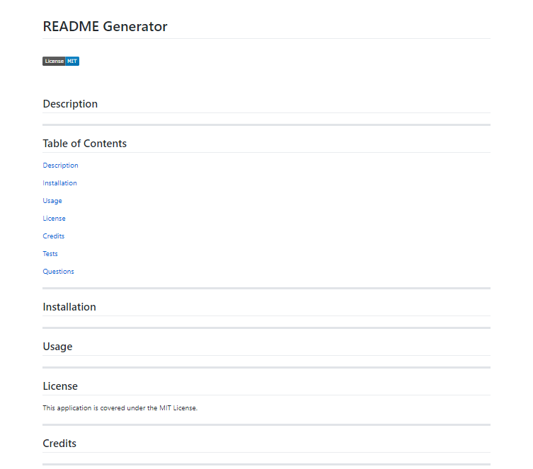

# README Generator



## Link

A video demonstration of how to use the application.

https://drive.google.com/file/d/1sWUFfq0IpVaYJGFWgRatr0M7apI3S9lo/view?usp=sharing

---


## Description

A command-line application using node.js that dynamically generates a professional README.md file from a user's input using the Inquirer package.

---

## Table of Contents

[Description](#description)

[Installation](#installation)

[Usage](#usage)

[Credits](#credits)

---

## Installation

1. Download node.js 

    * https://nodejs.org/en/

2. Open your terminal in the application file folder
    
    `./readme-generator`

2. Install the node modules for the inquirer package
    ```
    npm install
    ```

---

## Usage

1. Start the application
    ```
    npm start
    ```
    or

    ```
    node index.js
    ```
2. Answer the series of question prompts to fill out your README

<br>

***Note**: Your project title will be the name of your README*

**Example:** a project title of "Test 1"  will be named "test-1_README.md"

<br>

---

## Credits

Special thanks to Josh and the gang for their help!

https://stackoverflow.com/questions/2116558/fastest-method-to-replace-all-instances-of-a-character-in-a-string

https://opensource.org/licenses

https://shields.io/category/license

https://emojipedia.org/